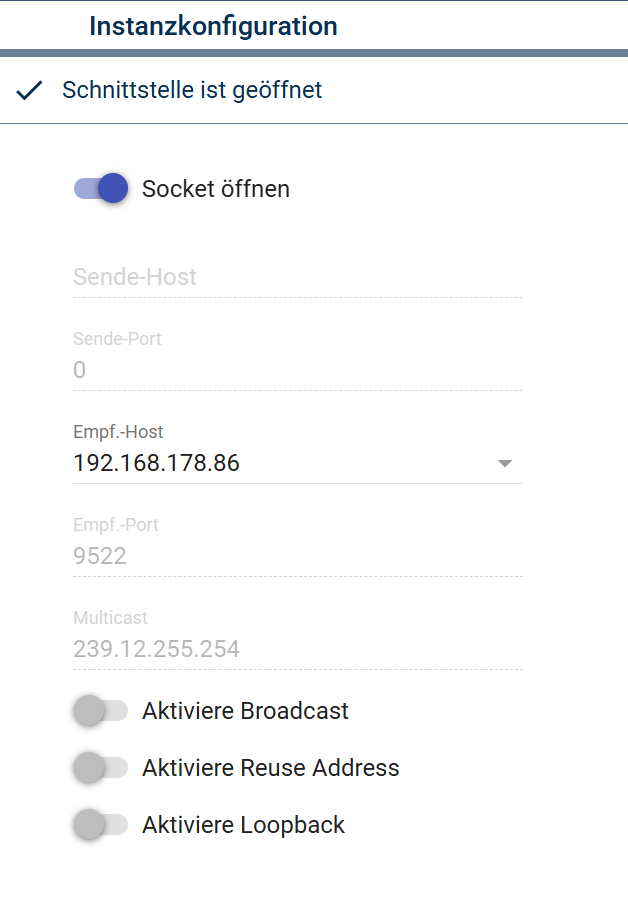

# SMA Home Manager Device

Das Modul wertet die Multicast-Datagramme eines SMA Energy Meters / Sunny Home Managers 2.0 aus und stellt die Messkanäle als Statusvariablen in IP-Symcon zur Verfügung.

### Inhaltsverzeichnis

1. [Funktionsumfang](#1-funktionsumfang)
2. [Voraussetzungen](#2-voraussetzungen)
3. [Software-Installation](#3-software-installation)
4. [Einrichten der Instanzen in Symcon](#4-einrichten-der-instanzen-in-symcon)
5. [Statusvariablen und Profile](#5-statusvariablen-und-profile)
6. [PHP-Befehlsreferenz](#6-php-befehlsreferenz)

### 1. Funktionsumfang

Das Modul empfängt über ein Multicast Socket die Nachrichten vom SMA Energy Meter / Sunny Home Manager 2.0 und stellt die Werte der Messkanäle als
Statusvariablen zur Verfügung.

### 2. Voraussetzungen

- Symcon ab Version 8.2

### 3. Software-Installation

* Über den Module Store wird das 'SMA Home Manager'-Modul installiert.
* Alternativ kann über das Module Control folgende URL hinzugefügt werden: https://github.com/bumaas/SMAHomeManager

### 4. Einrichten der Instanzen in Symcon

Unter 'Instanz hinzufügen' kann das 'SMA Home Manager Device'-Modul mithilfe des Schnellfilters gefunden werden.  
Allgemeine Informationen zum Hinzufügen von Instanzen gibt es in
der [Dokumentation der Instanzen](https://www.symcon.de/service/dokumentation/konzepte/instanzen/#Instanz_hinzufügen)

#### Konfigurationsseite der Geräteinstanz

| Name                                                               | Beschreibung                                                                                                                                                                                                |
|--------------------------------------------------------------------|-------------------------------------------------------------------------------------------------------------------------------------------------------------------------------------------------------------|
| Seriennummer                                                       | Die Seriennummer des SMA-Gerätes. Wenn das Feld leer bleibt, werden die Pakete aller empfangenen Geräte verarbeitet — bei mehreren SMA-Geräten im Netzwerk sollte die Seriennummer daher angegeben werden.  |
| Anzeige detaillierterer Messkanäle (Scheinleistung, Blindleistung) | Legt fest, ob neben der Wirkleistung auch die Blind- und Scheinleistung angezeigt werden soll.                                                                                                              |
| Anzeige einzelner Phasen                                           | Legt fest, ob zusätzlich zu den Summenwerten auch die Werte der einzelnen Phasen L1, L2 und L3 angezeigt werden sollen.                                                                                     |
| Verlängertes Aktualisierungsintervall                              | Der Multicast Socket empfängt jede Sekunde die Daten vom Energy Meter. Sollen die Daten weniger häufig verarbeitet werden, so kann das Intervall entsprechend hoch gesetzt werden (0 = keine Verlängerung). |
| Erweiterte Debug Informationen                                     | erlaubt eine tiefere Analyse der Verarbeitungsabläufe                                                                                                                                                       |

#### Konfigurationsseite der IO-Instanz

Beim Anlegen der Geräteinstanz wird automatisch auch der benötigte Multicast Socket angelegt und vorkonfiguriert (Port 9522, Multicast-IP 239.12.255.254).

Im Regelfall müssen hier keine manuellen Änderungen vorgenommen werden. Der 'Sende-Host' kann leer bleiben, da die Filterung der Daten direkt im Gerät über die Seriennummer erfolgt.

### 5. Statusvariablen und Profile

Die Statusvariablen werden automatisch angelegt. Das Löschen einzelner kann zu Fehlfunktionen führen.

Es werden alle Messkanäle angelegt, die im
Dokument [SMA Energy Meter - Zählerprotokoll](https://cdn.sma.de/fileadmin/content/www.developer.sma.de/docs/EMETER-Protokoll-TI-en-10.pdf)
beschrieben sind.

Das Modul übersetzt die technischen Messkanäle des SMA-Protokolls automatisch in lesbare Bezeichnungen. Besonders bei den Summenwerten (SUM) werden folgende Spezialbezeichnungen verwendet:

| SMA-Kanal (Protokoll) | Bezeichnung in Symcon (Beispiel)                       | Beschreibung                                          |
|-----------------------|--------------------------------------------------------|-------------------------------------------------------|
| Real Power +          | Netzbezug (Wirkleistung(+) gesamt)                     | Aktuelle Wirkleistung, die vom Netz bezogen wird.     |
| Real Power -          | Netzeinspeisung (Wirkleistung(-) gesamt)               | Aktuelle Wirkleistung, die ins Netz eingespeist wird. |
| Counter Real Power +  | Netzbezug Zähler (Zähler Wirkleistung(+) gesamt)       | Gesamte bezogene Energie (kWh).                       |
| Counter Real Power -  | Netzeinspeisung Zähler (Zähler Wirkleistung(-) gesamt) | Gesamte eingespeiste Energie (kWh).                   |

Je nach Konfiguration werden folgende Werte (als Summe oder pro Phase L1-L3) angelegt:
- **Wirkleistung (Bezug/Einspeisung)**: Aktueller Verbrauch bzw. Einspeisung in Watt (W).
- **Zählerstände**: Akkumulierte Energie in Kilowattstunden (kWh).
- **Netzfrequenz**: Aktuelle Frequenz in Hertz (Hz).
- **Zusatzwerte**: Optional können Blind- und Scheinleistung sowie Spannung und Stromstärke (pro Phase) aktiviert werden.

Zusätzlich werden Informationsvariablen angelegt:
- **SW-Version**: Die aktuell installierte Firmware-Version des SMA Gerätes.
- **Serial Number**: Die eindeutige Seriennummer des Gerätes.

#### Statusvariablen

#### Profile

Es werden keine globalen Profile angelegt. Das Modul nutzt Darstellungseigenschaften direkt an den Variablen.

### 6. PHP-Befehlsreferenz

Das Modul verfügt über keine eigenen Funktionen.