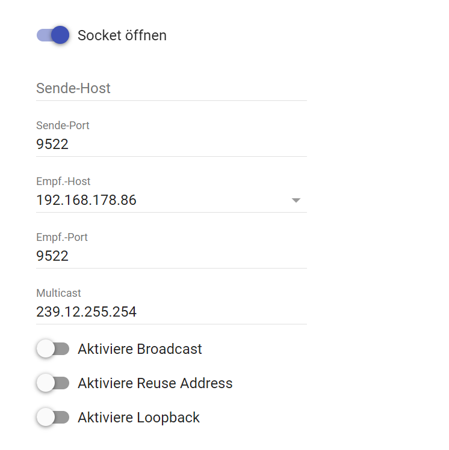

# SMA Home Manager Device
Beschreibung des Moduls.

### Inhaltsverzeichnis

1. [Funktionsumfang](#1-funktionsumfang)
2. [Voraussetzungen](#2-voraussetzungen)
3. [Software-Installation](#3-software-installation)
4. [Einrichten der Instanzen in IP-Symcon](#4-einrichten-der-instanzen-in-ip-symcon)
5. [Statusvariablen und Profile](#5-statusvariablen-und-profile)
6. [PHP-Befehlsreferenz](#6-php-befehlsreferenz)

### 1. Funktionsumfang

Das Modul empfängt über ein Multicast Socket die Nachrichten vom SMA Energy Meter / Sunny Home Manager 2.0 und stellt die Werte der Messkanäle als Statusvariablen zur Verfügung.

### 2. Voraussetzungen

- IP-Symcon ab Version 7.0

### 3. Software-Installation

* Über den Module Store wird das 'SMA Home Manager Device'-Modul installiert.
* Alternativ kann über das Module Control folgende URL hinzugefügt werden: https://github.com/bumaas/SMAHomeManager

### 4. Einrichten der Instanzen in IP-Symcon

 Unter 'Instanz hinzufügen' kann das 'SMA Home Manager Device'-Modul mithilfe des Schnellfilters gefunden werden.  
 Allgemeine Informationen zum Hinzufügen von Instanzen gibt es in der [Dokumentation der Instanzen](https://www.symcon.de/service/dokumentation/konzepte/instanzen/#Instanz_hinzufügen)

#### Konfigurationsseite der Geräteinstanz

| Name                                                               | Beschreibung                                                                                                            |
|--------------------------------------------------------------------|-------------------------------------------------------------------------------------------------------------------------|
| Anzeige detaillierterer Messkanäle (Scheinleistung, Blindleistung) | Legt fest, ob neben der Wirkleistung auch die Blind- und Scheinleistung angezeigt werden soll.                          |
| Anzeige einzelner Phasen                                           | Legt fest, ob zusätzlich zu den Summenwerten auch die Werte der einzelnen Phasen L1, L2 und L3 angezeigt werden sollen. |

#### Konfigurationsseite der IO-Instanz

Beim Anlegen der Geräteinstanz wird automatisch auch der benötigte Multicast Socket angelegt. Er ist wie folgt zu konfigurieren:

Als Sende-Host ist der Name oder die IP-Adresse des Home Manager anzugeben, als Empf.-Host der Name oder die IP-Adresse des Symcon Servers. 

### 5. Statusvariablen und Profile

Die Statusvariablen werden automatisch angelegt. Das Löschen einzelner kann zu Fehlfunktionen führen.

#### Statusvariablen

#### Profile

Es werden nur Standardprofile benutzt.

### 6. PHP-Befehlsreferenz

Das Modul verfügt über keine eigenen Funktionen.